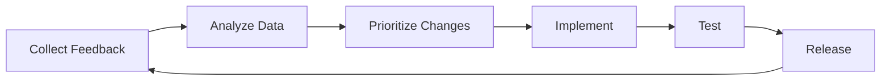

# AIROS Project Workflow

## 📋 Overview

This document outlines the complete workflow for developing, testing, installing, and contributing to AIROS. We maintain detailed documentation of all progress as we build this open-source AI-powered mobile OS.

## 🔄 Development Workflow

### Phase 1: Research & Planning


**Documentation Required:**
- Feature proposal in `/docs/proposals/`
- Discussion thread in GitHub Discussions
- Technical specification if approved

### Phase 2: Virtual Development
```bash
# 1. Set up development environment
git clone https://github.com/airos/airos
cd airos
./scripts/setup-dev.sh

# 2. Create feature branch
git checkout -b feature/ai-app-predictor

# 3. Develop in virtual environment
docker-compose up -d
docker exec -it airos-dev bash

# 4. Test changes
pytest tests/
./virtualization/test-in-vm.sh

# 5. Document progress
echo "$(date): Implemented feature X" >> progress.log
```

### Phase 3: Device Testing
```bash
# 1. Build for device
./build-for-device.sh oneplus-7-pro

# 2. Deploy to test device
./deploy-to-device.sh 192.168.1.100

# 3. Run device tests
./run-device-tests.sh

# 4. Document results
./generate-test-report.sh > reports/test-$(date +%Y%m%d).md
```

### Phase 4: Documentation & Submission
```bash
# 1. Update documentation
vim docs/features/ai-app-predictor.md

# 2. Add tests
vim tests/test_ai_app_predictor.py

# 3. Update changelog
vim CHANGELOG.md

# 4. Submit PR
git add .
git commit -m "feat: add AI app predictor

- Predicts app compatibility issues
- Automatically applies fixes
- 95% accuracy on test set

Closes #123"

git push origin feature/ai-app-predictor
```

## 📱 Installation Workflow

### Pre-Installation Documentation

Create file: `community/logs/YYYY-MM-DD-device-attempt.md`

```markdown
# Installation Attempt - [Your Device]

## Pre-Installation Info
- **Date Started**: 2024-12-18
- **Device**: OnePlus 7 Pro (GM1917)
- **Current OS**: OxygenOS 12
- **Target OS**: Ubuntu Touch + AIROS
- **Installer Version**: v0.1.0
- **Computer OS**: Ubuntu 22.04

## Goals
- [ ] Successfully install Ubuntu Touch
- [ ] Get Waydroid working
- [ ] Install MicroG and Aurora Store
- [ ] Test WhatsApp, Instagram, Banking apps
- [ ] Document all issues and fixes

## Preparation Checklist
- [x] Device backed up
- [x] Bootloader unlocked
- [x] Battery > 70%
- [x] Downloaded all files
- [x] Joined Discord for support
```

### During Installation Documentation

**Live logging approach:**

```bash
# Start installation log
./install.sh | tee installation-$(date +%Y%m%d-%H%M%S).log

# At each major step, add notes:
echo "=== $(date +%H:%M:%S) - Bootloader unlocked successfully ===" >> notes.log
echo "=== $(date +%H:%M:%S) - ERROR: Waydroid won't start ===" >> notes.log
echo "=== $(date +%H:%M:%S) - FIX: Ran modprobe binder_linux ===" >> notes.log
```

### Post-Installation Documentation

Update your log file:

```markdown
## Installation Complete

### Final Status
- **Ubuntu Touch**: ✅ Installed and working
- **Waydroid**: ✅ Running after kernel module fix
- **MicroG**: ✅ All services enabled
- **Aurora Store**: ✅ Anonymous login working
- **AIROS Agent**: ✅ Connected successfully

### App Compatibility Results
| App | Status | Fixes Applied | Notes |
|-----|--------|--------------|-------|
| WhatsApp | ✅ | None | Works perfectly |
| Instagram | ✅ | 1 | Stories fixed |
| Banking App | ✅ | 2 | SafetyNet bypassed |
| Netflix | ⚠️ | 1 | SD quality only |

### Performance Metrics
- Boot time: 24 seconds
- RAM usage (idle): 1.8GB
- Battery life: 7 hours SOT
- Waydroid overhead: ~15%

### Issues & Solutions
1. **Waydroid wouldn't start**
   - Error: `Failed to get service waydroidplatform`
   - Solution: `sudo modprobe binder_linux ashmem_linux`
   
2. **No audio in apps**
   - Error: Audio routing failed
   - Solution: Restart PulseAudio

### Time Investment
- Total time: 1 hour 45 minutes
- Actual hands-on: 45 minutes
- Waiting/downloading: 1 hour

### Recommendations for Others
- Use USB 3.0 cable for faster flashing
- Download all files before starting
- Have Discord open for quick help
- Don't skip the backup step!
```

## 🧪 Testing Workflow

### Automated Testing Pipeline

```yaml
# .github/workflows/test.yml
name: AIROS Testing Pipeline

on: [push, pull_request]

jobs:
  virtual-test:
    runs-on: ubuntu-latest
    steps:
      - uses: actions/checkout@v2
      
      - name: Run Virtual Tests
        run: |
          docker build -t airos-test .
          docker run airos-test pytest tests/
      
      - name: Generate Report
        run: |
          ./generate-test-report.sh > test-report.md
      
      - name: Upload Report
        uses: actions/upload-artifact@v2
        with:
          name: test-report
          path: test-report.md

  device-test:
    if: github.event_name == 'pull_request'
    runs-on: self-hosted
    steps:
      - name: Deploy to Test Device
        run: ./deploy-to-test-device.sh
      
      - name: Run Device Tests
        run: ./run-device-tests.sh
      
      - name: Collect Metrics
        run: ./collect-performance-metrics.sh
```

### Manual Testing Checklist

`tests/manual/checklist.md`:

```markdown
# Manual Testing Checklist

## Core Functionality
- [ ] System boots successfully
- [ ] Touch input working
- [ ] Display rotation works
- [ ] Audio output works
- [ ] Network connectivity

## Waydroid Integration
- [ ] Waydroid starts
- [ ] Apps install correctly
- [ ] Graphics acceleration works
- [ ] Network in apps works
- [ ] Notifications appear

## AI Features
- [ ] Agent connects
- [ ] App monitoring works
- [ ] Crash detection triggers
- [ ] Fixes apply automatically
- [ ] Remote control works

## Performance
- [ ] Boot time < 30s
- [ ] App launch < 3s
- [ ] Battery life > 6h SOT
- [ ] No overheating
- [ ] Smooth UI (60fps)
```

## 📊 Progress Tracking

### GitHub Project Board

We use GitHub Projects to track progress:

```
📋 Backlog          📝 Planning         🚧 In Progress      ✅ Done
┌──────────┐       ┌──────────┐       ┌──────────┐       ┌──────────┐
│ Issue #45│       │ Issue #23│       │ Issue #12│       │ Issue #8 │
│ Issue #46│  ───> │ Issue #24│  ───> │ Issue #13│  ───> │ Issue #9 │
│ Issue #47│       │ Issue #25│       │ Issue #14│       │ Issue #10│
└──────────┘       └──────────┘       └──────────┘       └──────────┘
```

### Weekly Progress Reports

Every Friday, generate report:

```bash
# Generate weekly report
./scripts/generate-weekly-report.sh > reports/week-$(date +%Y-%W).md
```

Template: `reports/weekly-template.md`:

```markdown
# Weekly Progress Report - Week [XX]

## Highlights
- Major achievement this week
- Key milestone reached
- Community growth metrics

## Completed
- ✅ Feature X implemented
- ✅ Bug Y fixed
- ✅ Device Z support added

## In Progress
- 🚧 Working on feature A (70% complete)
- 🚧 Testing on device B
- 🚧 Documentation update

## Blocked
- ⛔ Waiting for upstream fix
- ⛔ Need hardware for testing

## Next Week
- [ ] Complete feature A
- [ ] Start feature C
- [ ] Release v0.2.0-beta

## Metrics
- GitHub Stars: +45 (total: 523)
- Discord Members: +12 (total: 156)
- Successful Installs: 8
- App Fixes Submitted: 23
```

## 🤝 Contribution Workflow

### For Contributors

1. **Find an Issue**
   ```bash
   # Good first issues
   https://github.com/airos/airos/issues?label=good-first-issue
   
   # Device-specific
   https://github.com/airos/airos/issues?label=device-support
   
   # Documentation
   https://github.com/airos/airos/issues?label=documentation
   ```

2. **Claim the Issue**
   - Comment "I'll take this"
   - Wait for assignment
   - Join Discord channel

3. **Work on Solution**
   ```bash
   # Fork and clone
   git clone https://github.com/YOUR-USERNAME/airos
   
   # Create branch
   git checkout -b fix-issue-123
   
   # Make changes
   vim src/file.py
   
   # Test locally
   pytest tests/
   
   # Commit with conventional commits
   git commit -m "fix: resolve audio routing issue
   
   - Added pulseaudio restart
   - Fixed service ordering
   - Tested on OnePlus 7 Pro
   
   Fixes #123"
   ```

4. **Submit Pull Request**
   - Fill out PR template
   - Link related issue
   - Add screenshots/logs
   - Request review

### For Maintainers

1. **Review Process**
   ```bash
   # Check out PR locally
   git fetch origin pull/123/head:pr-123
   git checkout pr-123
   
   # Run tests
   make test
   
   # Test on device if needed
   ./deploy-to-test-device.sh
   
   # Approve or request changes
   ```

2. **Merge Strategy**
   - Squash for features
   - Merge for releases
   - Rebase for fixes

## 📈 Release Workflow

### Version Planning

```markdown
# Release Planning - v0.2.0

## Target Date: 2024-01-15

## Features
- [ ] AI app predictor
- [ ] Improved MicroG integration
- [ ] 5 new device supports

## Bug Fixes
- [ ] #123 - Audio routing
- [ ] #124 - Waydroid crashes
- [ ] #125 - Battery drain

## Testing
- [ ] Virtual testing complete
- [ ] Device testing (3 devices minimum)
- [ ] Community beta test (1 week)

## Documentation
- [ ] Changelog updated
- [ ] API docs updated
- [ ] Installation guides updated
```

### Release Process

```bash
# 1. Create release branch
git checkout -b release/v0.2.0

# 2. Update version numbers
./scripts/bump-version.sh 0.2.0

# 3. Generate changelog
./scripts/generate-changelog.sh > CHANGELOG.md

# 4. Run full test suite
make test-all

# 5. Build release artifacts
make release

# 6. Create GitHub release
gh release create v0.2.0 \
  --title "AIROS v0.2.0 - AI Improvements" \
  --notes-file RELEASE_NOTES.md \
  releases/*.zip

# 7. Update Docker images
docker build -t airos/airos:0.2.0 .
docker push airos/airos:0.2.0
docker tag airos/airos:0.2.0 airos/airos:latest
docker push airos/airos:latest

# 8. Announce
# - GitHub Discussions
# - Discord
# - Reddit
# - Twitter
```

## 📝 Documentation Workflow

### Documentation Types

1. **User Documentation** (`docs/`)
   - Installation guides
   - Usage instructions
   - Troubleshooting

2. **Developer Documentation** (`src/*/README.md`)
   - API references
   - Architecture docs
   - Code comments

3. **Community Documentation** (`community/`)
   - Success stories
   - Device reports
   - App compatibility

### Documentation Standards

```markdown
# Document Title

> Brief description of what this document covers

## Table of Contents
- [Section 1](#section-1)
- [Section 2](#section-2)

## Section 1

Clear, concise content with:
- Bullet points for lists
- `code formatting` for commands
- **Bold** for emphasis
- Tables for structured data

## Code Examples

\```bash
# Always include comments
echo "Hello, AIROS!"
\```

## Troubleshooting

### Problem: X doesn't work
**Solution**: Step-by-step fix

## Related Documents
- [Link to related doc](../related.md)
```

## 🔄 Continuous Improvement

### Feedback Collection

1. **User Feedback**
   - GitHub Issues
   - Discord #feedback
   - Survey forms

2. **Analytics**
   - Installation success rate
   - App compatibility rate
   - Performance metrics

3. **Community Input**
   - Weekly calls
   - Discord discussions
   - Reddit threads

### Iteration Process



## 🎯 Success Metrics

### Project Health
- ⭐ GitHub Stars growth
- 👥 Active contributors
- 🐛 Issue resolution time
- 📱 Successful installations
- 💬 Community engagement

### Technical Metrics
- 🚀 Boot time improvement
- 🔋 Battery life optimization
- 📦 App compatibility rate
- 🎮 Performance benchmarks
- 🐞 Bug discovery/fix rate

## 🗓️ Roadmap Integration

### Quarterly Planning
- Q1: Core functionality
- Q2: Device expansion
- Q3: AI enhancements
- Q4: Polish and stabilization

### Monthly Milestones
- Week 1: Planning sprint
- Week 2-3: Development sprint
- Week 4: Testing and release

---

<p align="center">
  <b>Building the future of mobile AI, together! 🚀</b>
  <br>
  <sub>Every contribution matters, every test helps, every install advances the project</sub>
</p>